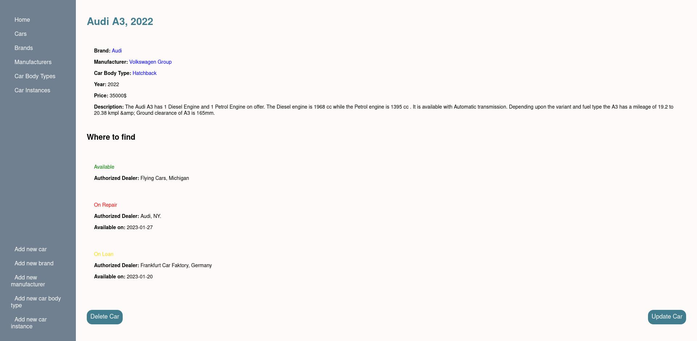
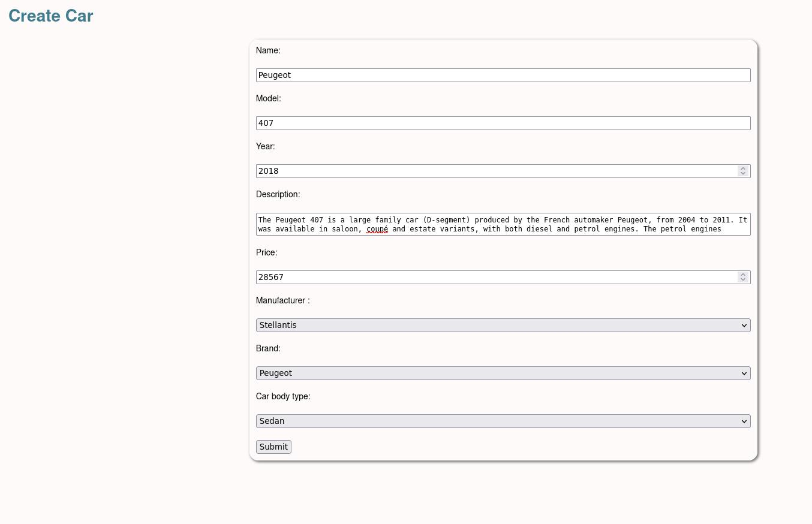
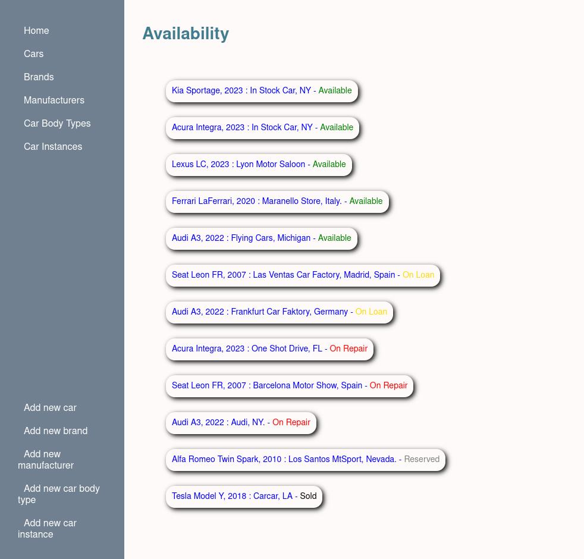

### Car Inventory

Car inventory made with MongoDB, Express, Node & Pug stack following the MVC (Model View Controller) pattern.

The database is made with MongoDB Atlas, to which you can add Cars, Brands, Manufacturers, Car Body Types, and Car Instances.

The correlation between the above elements is set up when the user creates the very element.

The database then updates all the information and is displayed to the rest of the website accordingly.

The app implements
